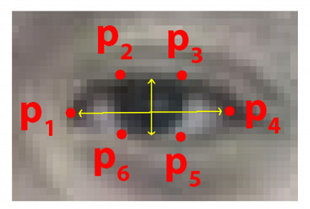

## Phát hiện ngủ gật sử dụng Dlib, OpenCV

### 1. Kiến thức cơ bản:
Bài toán sử dụng **Facial Landmark** để xác định các vị trí như mắt, mũi, miệng trên khuôn mặt. 


Nhưng trước khi xác định được vị trí các bộ phận trên khuôn mặt thì cần xác định (phát hiện) được khuôn mặt. Ở đây sử dụng đặc tính **Haar like**

Sau khi xác định được vị trí mắt trái, mắt phải thì tính tỷ lệ mắt theo công thức **EAR (eye aspect ratio)** được giới thiệu bởi `Soukupová` và `Čech` trong bài báo năm 2016 của họ, [Real-Time Eye Blink Detection Using Facial Landmarks](https://vision.fe.uni-lj.si/cvww2016/proceedings/papers/05.pdf). :

1. Các điểm mốc trên mắt:



2. Công thức tính tỷ lệ mắt:


### 2. Các file cần thiết:

[1] [haarcascade_frontalface_default.xml](https://raw.githubusercontent.com/opencv/opencv/master/data/haarcascades/haarcascade_frontalface_default.xml) (~ 1 Mb)

[2] [shape_predictor_68_face_landmarks.dat](https://github.com/biometrics/openbr-models/raw/master/dlib/shape_predictor_68_face_landmarks.dat) (~100 Mb)

Tải các file trên và để ngoài thư mục gốc.

### 3. Hướng dẫn chạy chương trình
Bước 1: Tạo môi trường ảo
```bash
mkvirtualenv dip -p python3.6
```

Bước 2: Sử dụng môi trường ảo
```bash
workon dip
```

Bước 3: Cài đặt các packages cần thiết
```bash
pip install -r requirements.txt
```

Bước 4: Chạy thử chương trình
```bash
python3 phathienngugat.py
```

### 4. Tài liệu tham khảo:
[1] [Face Dectection using haar cascade classifier](https://hackaday.io/project/12384-autofan-automated-control-of-air-flow/log/41956-face-detection-using-a-haar-cascade-classifier)

[2] [Real-Time Eye Blink Detection using Facial Landmarks](https://vision.fe.uni-lj.si/cvww2016/proceedings/papers/05.pdf)

[3] [Eye blink detection with OpenCV, Python, and dlib](https://www.pyimagesearch.com/2017/04/24/eye-blink-detection-opencv-python-dlib/)